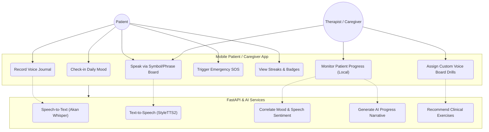
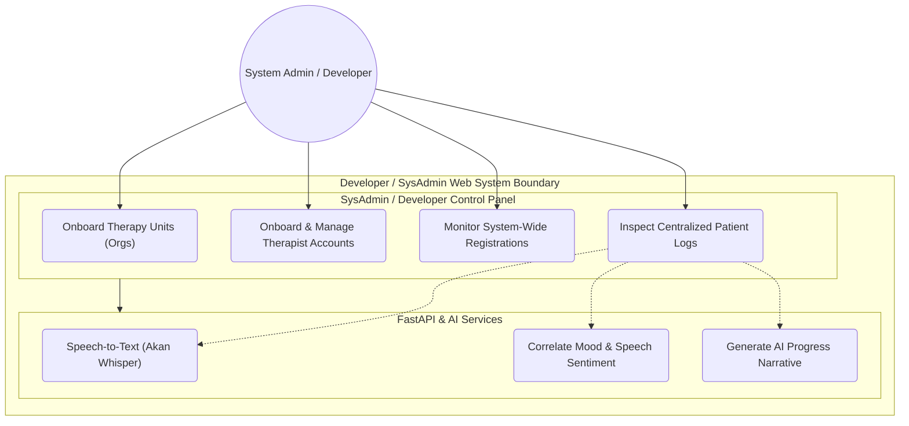

# VoiceAid Health — System Use Case Diagrams

This document separates the platform's features into two distinct UML Use Case diagrams to highlight user-facing client functionality vs. developer-facing administration controls.

---

## 1. Patient & Caregiver / Therapist Use Case Diagram
This diagram shows how speech-impaired patients and caregiver/therapist users interact with the mobile application and backend speech services during daily communication and therapy drills.

### Use Case Diagram (Mermaid)

### Mobile Use Case Descriptions
*   **Patient Actions**: Speaks via the visual board (symbol speak), records voice diaries (transcribed by Whisper ASR), executes check-in ratings, tracks badges, and triggers SOS distress alarms.
*   **Caregiver / Therapist Actions**: Accesses the shared caregiver portal on the phone to modify phrases, track patient exercise completion levels, and assign speech cards.

---

## 2. System Admin / Developer Use Case Diagram
This diagram shows how you (the developer/sysadmin) manage the clinical infrastructure from the Next.js control center, onboarding therapy clinics, managing accounts, and auditing diagnostic records.

### Use Case Diagram (Mermaid)

### Administration Use Case Descriptions
*   **Onboard Therapy Units (Orgs)**: Registers hospitals, clinics, or language therapy departments into the PostgreSQL schema, creating unique invite keys.
*   **Manage Therapist Accounts**: Activates, edits, and monitors credentials of speech therapists assigned to specific onboarded organizations.
*   **Centralized Patient Log Audits**: Inspects records (transcripts, compliance counts, check-in histories, sentiment metrics) to ensure system accuracy and run diagnostics.
